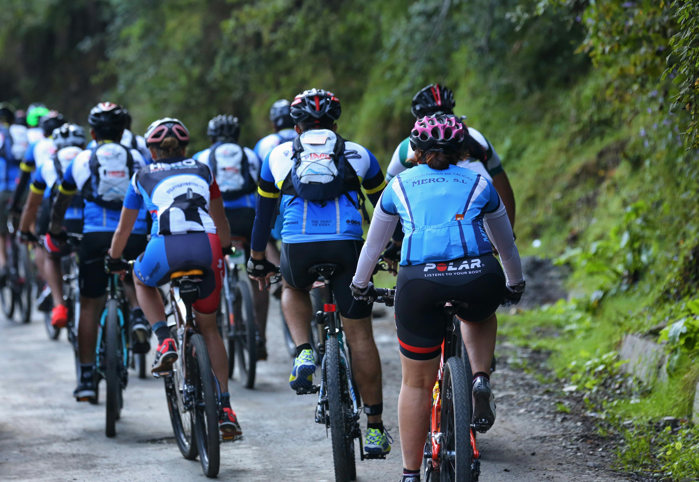
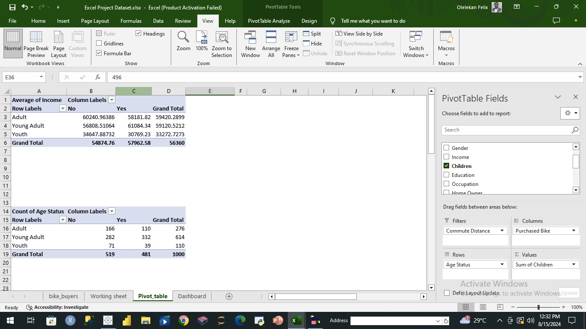
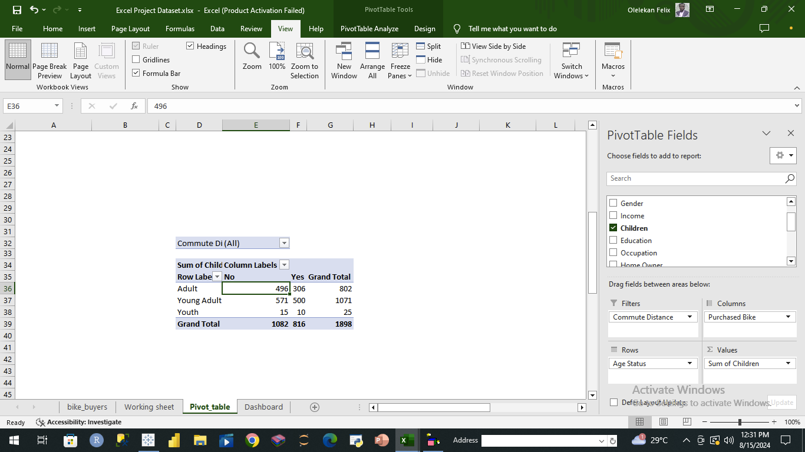
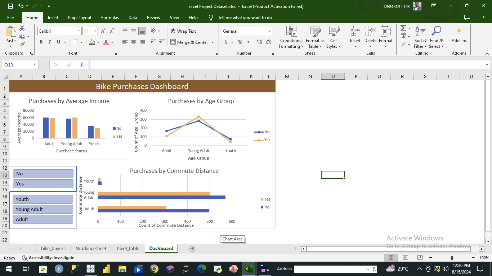

# GTE Rides- Bike Purchase Analysis

___
## Introduction
This project is out demonstrate some of my skills in Spreadsheet. Here, the use of "IF" function to create a new column, pivot table as well as interactive dashboard was highlighted.

**_Disclaimer_**: _The dataset and all the reports in this analysis do not represent any real company or entity. It's just for demonstration of Excel skills_.

## Problem Statement
The management of GTE Rides wanted to launch marketing campaigns for more sales. However, they noticed that age groups differed in the purchases of bikes. Therefore, they contacted a data analyst to use the already gathered data to find out how these age groups differed in purchasing bikes.
For the analysis, the problem statement is broken into specific evaluation questions:

1 How many adults, young adults, and youths bought bikes?

2 Across the age groups, how are the bike buyers and non-buyers compared in terms of  average income?

3 Who had more children between bike buyers and non-bike buyers?

## Skills/Concepts Demonstrated
Microsoft Excel was used for this analysis. The following skills were demonstrated;
- “IF” function to create a new column
- Pivot Tables and Charts
- Interactive Dashboard

## Getting the Data
The dataset was downloaded from YouTube tutorials. You can access it
It has 13 columns and 999 rows, but only fields relevant to evaluation questions were utilized in this analysis. 

## Investigating the Data
The dataset was checked for relevance to the evaluation questions. Also, the use of the data did not breach any data-related laws.

## Preparing the Data/ Data Transformation
- “Age Group column” was created  from “Age” column using **=IF(L2>50, "Adult", IF(L2<=30,"Youth",IF(L2>=31,"Young Adult")))**
- 3 Pivot Tables were created from 4 columns: Age Group, Children, Income and Purchased Bike
- Slicers, bar chart and line chart were used to visualize the Pivot Tables and build dashboard.

## Analysis and Visualizations
Pivot Tables were created from 4 columns: Age Group, Children, Income and Purchased Bike to summarise the desired data.
To visualize the trends and patterns in the analysis, slicers, bar chart and line chart were used.

Pivot Tables 
:----------------: | :---------------:
   | 

Interactive dashboard 

